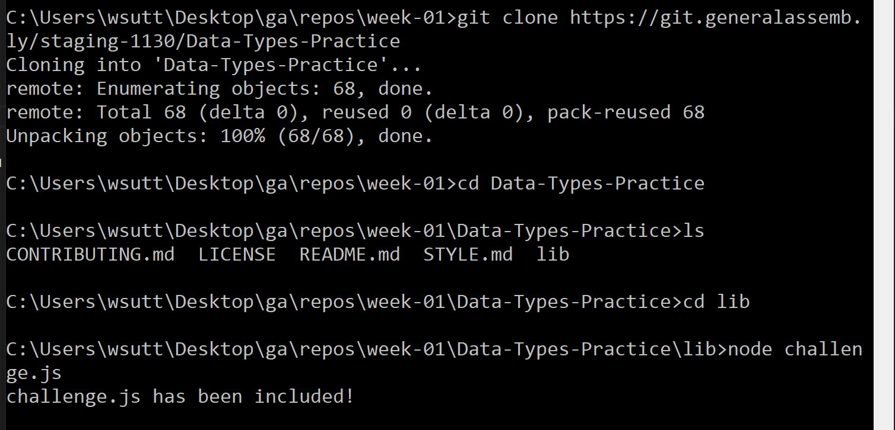

# Data Types Practice

This homework assignment will give you the opportunity to practice working with
the fundamentals of JavaScript covered in the prework.

## Prerequisites

* Fundamental JavaScript
* Numbers, Strings, and Booleans
* Variables
* Arrays
* Array Methods

## Instructions

1.  Fork and clone this repository.
1.  Change into the new directory and switch to a development branch.
1.  Fulfill the listed requirements.

Starter code is available in [`lib/challenge.js`](lib/challenge.js). You are
required to turn in your submission by making a pull request on the original
repository. 

Unless otherwise stated, homework is due at 9 am ET the next morning. Happy coding! 

**Make one commit for each prompt**

## Requirements

There are a series of prompts inside of the starter code found in
[`lib/challenge.js`](lib/challenge.js). Work through all of the prompts. Each
prompt is in the form of a JavaScript comment. Write your code to solve the
prompt *after* the comment.

You can use the javascript in two ways: 1.) by connecting it to `index.html` and viewing the output in Chrome DevTools Console, or 2.)  (Recommended) using `node` on the terminal to run the script as seen below:

> make sure to clone from your own fork! Not from SEIR-1130, as is done in the example above.

Some prompts will require you to practice researching methods we did not learn
in class.

> **Tip:** Use `console.log` to test your work, but delete those statements when you
> finish working on the prompt, before moving on to the next one! Otherwise,
> you'll end up with a lot of clutter in your console and it will be hard to
> debug the prompt you're currently working on.

**You are required to make one commit after each prompt**

## [License](LICENSE)

1.  All content is licensed under a CC­BY­NC­SA 4.0 license.
1.  All software code is licensed under GNU GPLv3. For commercial use or
    alternative licensing, please contact legal@ga.co.
